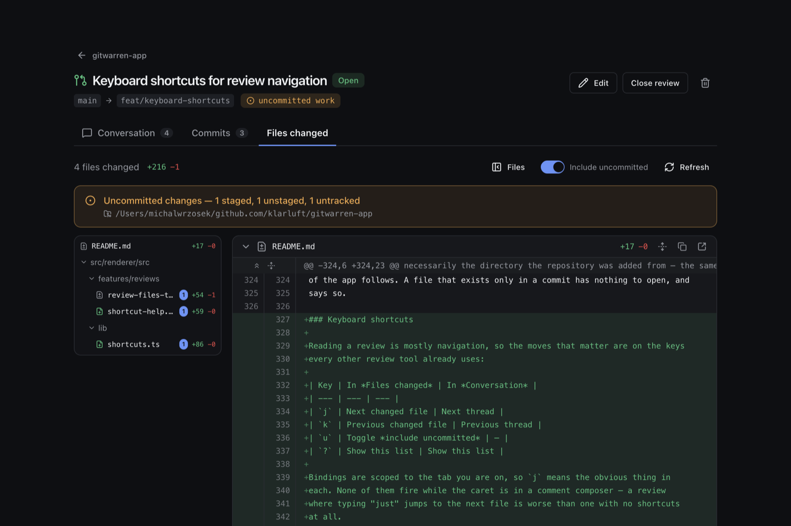

# GitWarren

**Code review for your own git repositories, on your own machines.** Your
machines, your agents, no one else's server — and no account.

Built for the moment a coding agent — Claude Code, Codex, or anything else that
edits files on your disk — has just finished, and its work is sitting in your
worktree uncommitted. Read that diff here, on your own machine, before it
becomes a commit.

**[gitwarren.com](https://gitwarren.com)** has downloads for macOS, Windows and
Linux.

<a href="https://gitwarren.com"></a>

---

## What it does

Tell GitWarren which local git repositories you care about, then open **reviews**
against them — a review is a comparison of two refs, presented the way a pull
request is, with *conversation*, *commits* and *files changed* tabs.

- **Review work before it is a commit.** If the branch you are reviewing is
  checked out in a worktree, GitWarren finds that worktree — wherever it is — and
  folds its staged, unstaged and untracked changes into the diff. That is exactly
  when review is most useful, and it is the part that makes this worth having.
- **Nothing is cached.** Every branch name, commit and diff on screen is read
  from git at the moment it is shown.
- **Nothing leaves your machine.** Reviews live in one SQLite file in your
  application-data directory. No account, no telemetry; the desktop app's one
  outbound request is the update check.
- **Agents are first-class.** Local AI agents get the same capabilities through
  an MCP server over stdio — they open reviews, read your comments, reply in a
  thread and resolve what they fixed.
- **Desktop app or browser.** It runs as an Electron app on macOS, Windows and
  Linux, or as a command that serves the same review UI into a browser tab. Same
  renderer either way; the shell is the only thing that differs.
- **Your other machines too.** A machine with no screen at all — a VPS, a WSL
  distro, a box an agent works on — runs the headless half and is reviewed from
  somewhere else, over SSH, over `wsl.exe`, or over your own tailnet. Reviews
  live on the machine the code is on and stay there; nothing is replicated or
  relayed anywhere but the computers you already own.

---

## Install

### The desktop app

Download it from **[gitwarren.com](https://gitwarren.com)**, or on macOS:

```bash
brew install --cask klarluft/tap/gitwarren
```

### The command line

Serves the same review UI in a browser instead of an Electron window — for a
machine that will not have the app on it, or one with no screen at all:

```bash
brew install klarluft/tap/gitwarren-cli               # macOS and Linux, brings its own Node
curl -fsSL https://gitwarren.com/install.sh | sh      # macOS and Linux, no Homebrew needed
npx gitwarren serve                                   # anywhere Node 22.14+ is, including Windows
```

Then `gitwarren serve --open`. See
[The `gitwarren` command line](docs/cli.md).

### Into a coding agent

If you arrive from a coding agent, start here instead. The plugin brings the MCP
server and a note that teaches the agent when to open a review and how to answer
your comments:

```bash
/plugin marketplace add klarluft/gitwarren-app       # Claude Code, then:
/plugin install gitwarren@gitwarren
gemini extensions install https://github.com/klarluft/gitwarren-app
npx skills add klarluft/gitwarren-app                 # the note alone, for any agent
```

Cursor, Codex, VS Code and Kiro read the same repository from their plugin
screens. See [Installing it as a plugin](docs/agents.md#installing-it-as-a-plugin).

---

## Documentation

| Guide | What is in it |
| --- | --- |
| [Reviews](docs/reviews.md) | What a review is, how uncommitted work is found, reading and navigating a large diff, marking files reviewed, opening a file in your editor |
| [Agent access (MCP)](docs/agents.md) | The MCP tools, installing the plugin, how an agent links you back into the app, comment threads, images |
| [The `gitwarren` command line](docs/cli.md) | `serve`, `service install`, the four ways to install the CLI, updating and removing it |
| [Your other machines](docs/remote-hosts.md) | Reaching a repository over SSH, over `wsl.exe` from Windows, on your tailnet, and from a phone |
| [Architecture](docs/architecture.md) | The stack, the shared service layer both surfaces call, and what is and is not stored |
| [Development](docs/development.md) | Running from source, the project layout, database migrations |
| [Releasing](docs/releasing.md) | Cutting a release, auto-update, code signing and notarization |
| [Known limitations](docs/limitations.md) | What GitWarren does not do, and why |
| [GitWarren across hosts](docs/across-hosts.md) | The design plan behind the remote-host model |

Agents setting GitWarren up on a user's machine should read
[llms-install.md](llms-install.md).

---

## Contributing

Contributions are welcome. Anything larger than a bug fix starts as a discussion
in
[Ideas](https://github.com/klarluft/gitwarren-app/discussions/categories/ideas),
so the shape can be agreed before you spend time on it; once it is settled it
becomes an issue. See [CONTRIBUTING.md](CONTRIBUTING.md) for the development
workflow, the two design constraints that changes need to respect, and what a
good pull request looks like here.

Before a first contribution can be merged you will be asked to sign the
[Contributor License Agreement](CLA.md). A bot handles it on your pull request;
it takes about ten seconds and only happens once. The CLA keeps copyright in the
codebase in one place, which is what makes it possible to offer GitWarren under
a commercial licence alongside the GPL, or to change licence later, without
having to track down every past contributor. You keep full ownership of your
work and can use it elsewhere however you like.

---

## Support and privacy

Questions, ideas and setups worth copying go to
[Discussions](https://github.com/klarluft/gitwarren-app/discussions) —
[Q&A](https://github.com/klarluft/gitwarren-app/discussions/categories/q-a) if
you are stuck on something,
[Ideas](https://github.com/klarluft/gitwarren-app/discussions/categories/ideas)
for a feature, and
[Show and tell](https://github.com/klarluft/gitwarren-app/discussions/categories/show-and-tell)
for an agent or remote-machine arrangement other people should steal. Bugs you
can describe — what GitWarren does, and when — go to
[issues](https://github.com/klarluft/gitwarren-app/issues). Anything you would
rather not post publicly goes to **contact@klarluft.com**.

GitWarren keeps everything on your machine: reviews live in one SQLite file in
your application-data directory, the diff is read from your git worktree, and
there is no account and no telemetry. The desktop app's one outbound request is
the auto-update check against this repository's GitHub Releases. The website's
[privacy policy](https://gitwarren.com/privacy/) covers gitwarren.com itself.

---

## License

GitWarren is free software, licensed under the **GNU General Public License,
version 3 or (at your option) any later version**. The full text is in
[LICENSE](LICENSE).

In short: you may use, study, modify and redistribute it, including
commercially. If you distribute a modified version, or a program that
incorporates this one, you must release that under the GPL as well and make the
source available. That reciprocity is the point — it keeps GitWarren and
anything built on it open.

The copyright is held by **Klarluft B.V.** (Rotterdam, The Netherlands · KVK
86875590), and every contribution is covered by the [CLA](CLA.md). Because the
copyright sits in one place rather than being spread across contributors, a
licence other than the GPL — for embedding GitWarren in a closed-source product,
for instance — can be granted on request: email **contact@klarluft.com**.

[Michal Wrzosek](https://github.com/michal-wrzosek) (<michal@wrzosek.pl>) is the
creator of GitWarren and currently its main maintainer.

```
Copyright © 2026 Klarluft B.V.

This program is free software: you can redistribute it and/or modify it under
the terms of the GNU General Public License as published by the Free Software
Foundation, either version 3 of the License, or (at your option) any later
version.

This program is distributed in the hope that it will be useful, but WITHOUT ANY
WARRANTY; without even the implied warranty of MERCHANTABILITY or FITNESS FOR A
PARTICULAR PURPOSE. See the GNU General Public License for more details.

You should have received a copy of the GNU General Public License along with
this program. If not, see <https://www.gnu.org/licenses/>.
```
